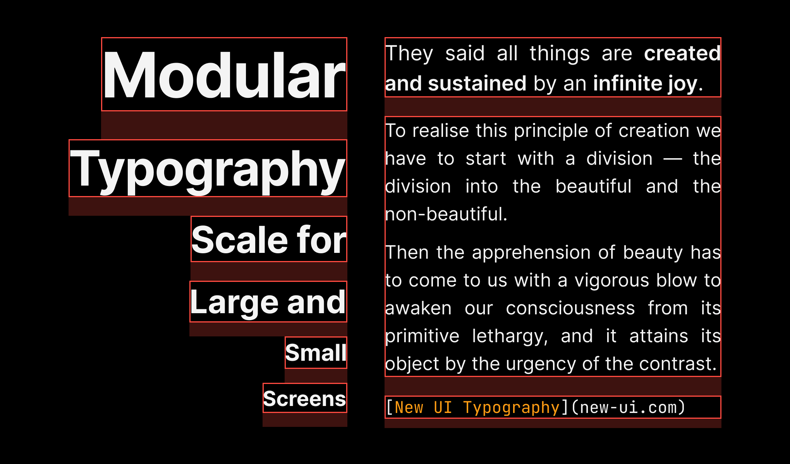

## Text Styles for Figma
[Get a Figma copy](https://www.figma.com/community/file/1186085071546203382)

## Install
Install New UI Typography from your terminal via npm. Current version is 0.1.0

```
npm i @new-ui/typography
```

## New UI Typography

### Desktop Headings
Decision Tokens | Name | Size(px/rem) | Line height(px/rem) | Weight | Letter spacing (px/rem)
:--- |:--- |:--- |:--- |:--- |:---
`$heading-01` | Heading 01 | 54 | 64 | Bold | -1.2px
`$heading-02` | Heading 02 | 42 | 50 | Bold | -0.8px
`$heading-03` | Heading 03 | 32 | 40 | Bold | -0.4px
`$heading-04` | Heading 04 | 28 | 36 | Bold | 0
`$heading-05` | Heading 05 | 20 | 28 | Bold | 0
`$heading-06` | Heading 06 | 18 | 26 | Bold | 0

### Desktop Body
Decision Tokens | Name | Size(px/rem) | Line height(px/rem) | Weight | Letter spacing (px/rem)
:--- |:--- |:--- |:--- |:--- |:---
`$body-large` | Body large | 18 | 26 | Regular | 0
`$body` | Body | 16 | 24 | Regular | 0
`$body-small` | Body small | 14 | 20 | Regular | 0
`---` | Body large, semi bold | 18 | 26 | Semi Bold | 0
`---` | Body, semi bold | 16 | 24 | Semi Bold | 0
`---` | Body small, semi bold | 14 | 20 | Semi Bold | 0

### Desktop Links
Decision Tokens | Name | Size(px/rem) | Line height(px/rem) | Weight | Letter spacing (px/rem)
:--- |:--- |:--- |:--- |:--- |:---
`---` | Link large | 18 | 26 | Regular | 0
`---` | Link | 16 | 24 | Regular | 0
`---` | Link small | 14 | 20 | Regular | 0
`---` | Link large, semi bold | 18 | 26 | Semi Bold | 0
`---` | Link, semi bold | 16 | 24 | Semi Bold | 0
`---` | Link small, semi bold | 14 | 20 | Semi Bold | 0

### Desktop Utility
Decision Tokens | Name | Size(px/rem) | Line height(px/rem) | Weight | Letter spacing (px/rem)
:--- |:--- |:--- |:--- |:--- |:---
`$caption` | Caption | 12 | 16 | Semi Bold | 0
`$helper-text` | Helper text | 12 | 16 | Regular | 0
`$code` | Code | 14 | 20 | Regular | 0

### Mobile Headings
Decision Tokens | Name | Size(px/rem) | Line height(px/rem) | Weight | Letter spacing (px/rem)
:--- |:--- |:--- |:--- |:--- |:---
`$heading-01` | Heading 01 | 32 | 40 | Bold | -0.8px
`$heading-02` | Heading 02 | 28 | 36 | Bold | -0.4px
`$heading-03` | Heading 03 | 24 | 30 | Bold | -0.4px
`$heading-04` | Heading 04 | 20 | 28 | Bold | 0
`$heading-05` | Heading 05 | 18 | 26 | Bold | 0
`$heading-06` | Heading 06 | 16 | 24 | Bold | 0

### Mobile Body
Decision Tokens | Name | Size(px/rem) | Line height(px/rem) | Weight | Letter spacing (px/rem)
:--- |:--- |:--- |:--- |:--- |:---
`$body-large` | Body large | 16 | 24 | Regular | 0
`$body` | Body | 14 | 20 | Regular | 0
`$body-small` | Body small | 12 | 16 | Regular | 0
`---` | Body large, semi bold | 16 | 24 | Semi Bold | 0
`---` | Body, semi bold | 14 | 20 | Semi Bold | 0
`---` | Body small, semi bold | 12 | 16 | Semi Bold | 0

### Mobile Links
Decision Tokens | Name | Size(px/rem) | Line height(px/rem) | Weight | Letter spacing (px/rem)
:--- |:--- |:--- |:--- |:--- |:---
`---` | Link large | 16 | 24 | Regular | 0
`---` | Link | 14 | 20 | Regular | 0
`---` | Link small | 12 | 16 | Regular | 0
`---` | Link large, semi bold | 16 | 24 | Semi Bold | 0
`---` | Link, semi bold | 14 | 20 | Semi Bold | 0
`---` | Link small, semi bold | 12 | 16 | Semi Bold | 0

### Mobile Utility
Decision Tokens | Name | Size(px/rem) | Line height(px/rem) | Weight | Letter spacing (px/rem)
:--- |:--- |:--- |:--- |:--- |:---
`$caption` | Caption | 12 | 16 | Semi Bold | 0
`$helper-text` | Helper text | 12 | 16 | Regular | 0
`$code` | Code | 14 | 20 | Regular | 0